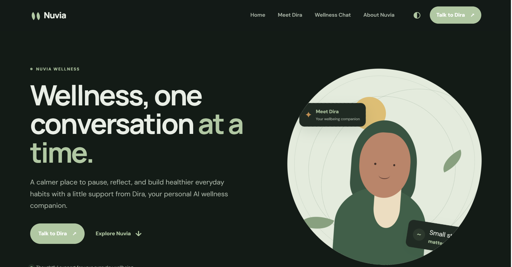

## Preview


# Nuvia Wellness

Nuvia is a calm wellness web application featuring Dira, an AI wellness companion powered by Google Gemini.

## Requirements

- Node.js 22 or newer
- A Google Gemini API key
- Docker (optional)

## Environment

Create a `.env` file in the project root:

```env
GEMINI_API_KEY=your_gemini_api_key
PORT=3000
```

Never commit `.env` or expose the API key in frontend code.

## Run locally

Install dependencies:

```bash
npm ci
```

Start the production server:

```bash
npm start
```

For development with automatic restart:

```bash
npm run dev
```

Open <http://localhost:3000> in a browser.

## Run with Docker

Build the image:

```bash
docker build -t nuvia-wellness .
```

Run the container using your local `.env` file:

```bash
docker run --rm --env-file .env -p 3000:3000 nuvia-wellness
```

Open <http://localhost:3000> in a browser.

You can also provide the variables directly:

```bash
docker run --rm -p 3000:3000 -e GEMINI_API_KEY=your_gemini_api_key nuvia-wellness
```

## API

### `POST /api/chat`

Request body:

```json
{
  "conversation": [
    { "role": "user", "text": "I want to improve my sleep" },
    { "role": "model", "text": "What does your current evening routine look like?" },
    { "role": "user", "text": "I usually use my phone until midnight" }
  ]
}
```

Successful response:

```json
{
  "result": "A Gemini-generated wellness response"
}
```

The frontend calls this endpoint automatically. The Gemini API key remains on the server.

## Project structure

```text
.
├── index.js
├── package.json
├── Dockerfile
├── prompts/
│   └── dira_system_instruction.md
└── public/
    ├── index.html
    ├── script.js
    └── style.css
```

## Notes

Dira provides general wellness information and supportive conversation. It is not a substitute for qualified medical or mental-health care. Do not share passwords, financial information, authentication codes, or unnecessary personal information.
